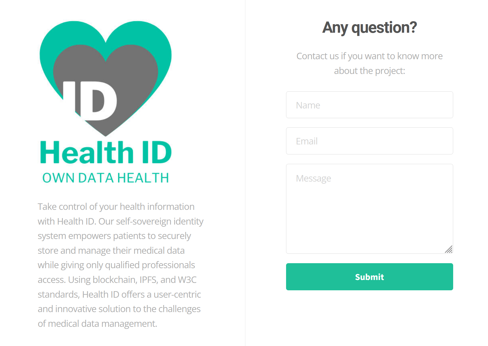

<!--
*** Thanks for checking out the Best-README-Template. If you have a suggestion
*** that would make this better, please fork the repo and create a pull request
*** or simply open an issue with the tag "enhancement".
*** Thanks again! Now go create something AMAZING! :D
-->


<!-- PROJECT SHIELDS -->
<!--
*** I'm using markdown "reference style" links for readability.
*** Reference links are enclosed in brackets [ ] instead of parentheses ( ).
*** See the bottom of this document for the declaration of the reference variables
*** for contributors-url, forks-url, etc. This is an optional, concise syntax you may use.
*** https://www.markdownguide.org/basic-syntax/#reference-style-links
-->

[](https://github.com/diegotorreslopez81/HealthID)
[](https://github.com/diegotorreslopez81/HealthID/network/members)
[](https://www.linkedin.com/company/HealthID)
<!-- [](https://www.twitter.com/HealthID_co)-->
[](https://owndata.health/)


<!-- PROJECT LOGO -->
<br />
<table align="center"><tr><td align="center" width="9999">
  <a href="https://github.com/diegotorreslopez81/HealthID">
    
  </a>

  <h1 align="center">The world's simplest paywall</h1>

  <p align="center">
    Welcome to our project
    <br />
    <strong>Want to know more? Explore our documents »</strong>
    <br />
    </td></tr></table>
<ol>
<li><a href="https://box.pdata.org/cloud/index.php/s/4D3HEH4wRCn6CEZ">HealthID presentation</a></li>
<!-- <li><a href="https://app.dashboard.HealthID.co">View Dashboard</a></li>
<li><a href="https://app.wallet.HealthID.co">View Mobile PWA</a></li>
<li><a href="https://demo.HealthID.co">Demo Web Content</a></li> -->
<li><a href="https://github.com/diegotorreslopez81/HealthID/issues">Report Bug</a></li>
<li><a href="https://github.com/diegotorreslopez81/HealthID/issues">Request Feature</a></li>
</ol>    
    
  </p>


<!-- TABLE OF CONTENTS -->
<details open="open">
  <summary>
  Table of Contents
  </summary>
  <ol>
    <li>
      <a href="#about-the-project">About The Project</a>
      <ul>
        <li><a href="#built-with">Built With</a></li>
      </ul>
    </li>
    <li>
    <a href="#projects">Projects</a>
    <ul>
    <li><a href="#dashboard">Dashboard</a></li>
    <li><a href="#api">API</a></li>
    <li><a href="#progressive-web-app">Progressive web app</a></li>
    </ul>
    </li>
    <li>
      <a href="#getting-started">Getting Started</a>
      <ul>
        <li><a href="#prerequisites">Prerequisites</a></li>
        <li><a href="#setup">Setup</a></li>
      </ul>
    </li>
    <li><a href="#the-team">The Team</a></li>
    <li><a href="#use-case-demo">Use Case Demo</a></li>
    <li><a href="#contributing">Contributing</a></li>
    <li><a href="#terms-and-license">Terms and License</a></li>
    <li><a href="#about-us">About Us</a></li>
    <li><a href="#contact">Contact</a></li>
  </ol>
</details>


<!-- ABOUT THE PROJECT -->

## About The Project
<div align="center" width="9999">
  <a href="https://owndata.health/">
    
  </a>

</div>

### What is HealthID?

Take control of your health information with Health ID. Our self-sovereign identity system empowers patients to securely store and manage their medical data while giving only qualified professionals access. Using blockchain, IPFS, and W3C standards, Health ID offers a user-centric and innovative solution to the challenges of medical data management.


### Built With

This section should list any major frameworks that you built your project using. Leave any add-ons/plugins for the acknowledgements section. Here are a the most importants.
* [NodeJS](https://nodejs.org/en/)
* [React](https://reactjs.org/)
* [Zenroom](https://zenroom.org/)
* [MongoDB](https://www.mongodb.com/)
* [Material UI](https://material-ui.com/)

<!-- PROJECTS -->
## Projects

### Dashboard
- [Dashboard](https://github.com/diegotorreslopez81/HealthID/tree/main/packages/dashboard)
- HealthID Dashboard is coded in React is designed to provide a content log to block and monetize, as well as metrics for your blocked content. 

### Progressive Web App (HealthID Wallet)
- [PWA](https://github.com/HealthID/tree/main/packages/smartwallet-pwa)
- HealthID wallet is a Progressive Web App fully encoded in React. HealthID Wallet is designed to provide verifiable credential issuing and sharing and QR code scanner. 

### API
- [API](https://github.com/diegotorreslopez81/HealthID/tree/main/packages/api)
- HealthID API is coded in NodeJS and Zenroom, designed to run microservices required by the Dashboard and the progressive web app. 

<!-- GETTING STARTED -->
## Getting Started

### Prerequisites

- [git](https://git-scm.com/) v2.13 or greater
- [NodeJS](https://nodejs.org/en/) `12 || 14 || 15 || 16`
- [npm](https://www.npmjs.com/) v6 or greater

All of these must be available in your `PATH`. To verify things are set up
properly, you can run this:

```shell
git --version
node --version
npm --version
```

If you have trouble with any of these, learn more about the PATH environment
variable and how to fix it here for [windows](https://www.howtogeek.com/118594/how-to-edit-your-system-path-for-easy-command-line-access/) or [mac/linux](https://stackoverflow.com/questions/24306398/how-to-add-mongo-commands-to-path-on-mac-osx/24322978#24322978).

### Setup

> If you want to commit and push your work as you go, you'll want to
> [fork](https://docs.github.com/en/free-pro-team@latest/github/getting-started-with-github/fork-a-repo)
> first and then clone your fork rather than this repo directly.
After you've made sure to have the correct things (and versions) installed, you
should be able to just run a few commands to get set up:

```
git clone https://github.com/diegotorreslopez81/HealthID.git
```

<!-- 
If you want to run HealthID, you should wake up the API, then run the Dashboard, install Publisher JS in the site you want to sell content and finally use the PWA to generate credentials and payments.


Consult the different project documentation to use:

- [Dashboard](./packages/dashboard/README.md)
- [Progressive web app](./packages/smartwallet-pwa/README.md)
- [API](./packages/api/README.md)
- [Publisher JS](./packages/publisherjs/README.md)
-->

<!-- The Team -->
## The Team

Diego Torres is the CEO and founder of the company, telecommunications engineer, with a master in business MBA by ENEB and mastering in Cybersecurity by INISEG. He has more than 15 years of experience in digital project development, management of multidisciplinary and multicultural teams. He has worked for companies in the multimedia content sector such as Atresmedia, Grupo Prisa, Grupo Godó, Unidad editorial, consulting firms such as IBM, Península, Grant Thornton, in the banking sector he has worked for Banco Sabadell, leading Blockchain projects, participating in the working group of the EBA (European Bank Associtation) to define the challenges and actions derived from Blockchain and IoT; he has also participated in the definition of innovative products such as the Decentralized Digital Identity of Caelum Labs. He is currently leading Next Unicorns, an innovation and development consultancy for Blockchain, Cybersecurity, Data Privacy projects, following the European model Self-Sovereign Identity. 
[Linkedin](https://www.linkedin.com/in/torreslopezdiego/)
[Twitter](https://twitter.com/DiegoTorresBCN)
[Gitlab](https://gitlab.com/diegotorreslopez)

Jose Juan Sanz is a computer engineer with more than 15 years of experience developing complex software projects. He has helped La Caixa in several solutions, highlighting the high performance ticketing platform for the sale of tickets in concerts with more traffic in Spain. He has worked with Diego Torres for the last 8 years, developing AI technology and Big Data, an engine capable of generating questions and answers in real time from digital content. For the last 5 years, Jose has been developing Blockchain pilots for Banco Sabadell and Peninsula.
[Linkedin](https://www.linkedin.com/in/josejuansanz/)
[Gitlab](https://gitlab.com/josejuansanz)

Irene Martínez is a passionate marketer. Irene is trained in physiotherapy, but her passion for social media since 2010 made her start her career as an entrepreneur. She has helped as an acquisition expert in several projects and startups such as Quizlyse, Incubio, Propdecasa, etc., always related to marketing and sales. She has also led entrepreneurship programs in accelerators and in the College of Physiotherapists. Currently, at Infinite Labs, she is responsible for marketing and communication and will be in charge of HealthID's business area. 
[Linkedin](https://www.linkedin.com/in/irenemape/)

Jhonny Varela is a Venezuelan Blockchain programmer with more than 3 years of experience. He studied computer science, where he discovered that his main motivation is intellectual challenges. At that stage he began to program research projects of the university in Venezuela. A few months ago he moved to Spain, and continued his professional career in Blockchain development, that's how he met Diego and started his stage in Infinite Labs. Here, she is the person responsible for development in decentralized technologies and cryptography, studying the SSI models of Alastria ID, Sovrin and Jolocom, and technologies such as Zenroom and IDX.
[Linkedin](https://www.linkedin.com/in/jhonny-varela-visbal-172441209/)
[Gitlab](https://github.com/jhonnyV-V)


As a team, we perfectly combine business and technology worlds, having created several Internet solution together.

<!-- Use Case Demo 
## Use Case Demo

You can try our solution following these steps:
1- Visit [Dashboard](https://app.dashboard.HealthID.co) 
2- Access with our demo user: username "demo@HealthID.co" and password "HealthID"
3- Imagine you are a publisher and you want to sell content by a condition, and you are the owner of this site [Publisher Media](https://demo.HealthID.co).
4- Choose a URL from your [Publisher Media](https://demo.HealthID.co) and go to "Monetize Your Content" on [Dashboard](https://app.dashboard.HealthID.co).
5- Add price and select the condition (you are asking a user for this credential).
6- Now, as user that wants to access the content you've already blocked, visit this URL.
7- The user, have to access to his wallet [HealthID wallet](https://github.com/HealthID/tree/main/packages/HealthID-wallet).
8- Add your datebirth and Ask for Credential.
9- Now go to issuer platform to validate that credential dashboard [Dashboard](https://app.dashboard.HealthID.co)
10- Access with our demo issuer: username "issuer@HealthID.co" and password "4a8X8Vphu9vpQH"
11- Check the credential and Validate it.
12- The user will receive the credential in youre wallet signed by HealthID, the ZKP and the W3C credential.
13- Now, you can scan the QR code from the URL.
14- You have to accept sharing your credential.
15- If you met the credential conditions, add the payment method and purchase that content.
16- The content will be unlocked inmediately.
17- As user, you will have the content purchased in your Articles tab, accessible forever you want without asking again for your credential.
18- Now, you can play more with our demo blocking more content and adding more conditions.


If you get any errors, please read through them and see if you can find out what
the problem is. If you can't work it out on your own then please [file an issue](https://github.com/HealthID/issues) and provide _all_ the output from the commands you ran (even if it's a lot).
-->

<!-- CONTRIBUTING -->
## Contributing

**Working on your first Pull Request?** You can learn how from this _free_
guide [How to Contribute to an Open Source Project on GitHub](https://github.com/freeCodeCamp/how-to-contribute-to-open-source) 

If you have made a Pull Request, see our guide to [contributing](./CONTRIBUTING.md)

<!-- LICENSE -->
## Terms and License

- Released under the [MIT](./LICENSE).
- Copyright 2021 [Infinite Labs](https://infinitelabs.co/).
- Use it for personal and commercial projects, but please don’t republish, redistribute, or resell the application.

<!-- ABOUT US -->
## About Us

We focus on building a more secure, private and social internet using Open-Source and decentralized technologies.

As a team, we have developing digital products since 2012. In the last 5 years, we have focused on decentralized technologies. We aim to create products that can make a social impact. Because of that, we only use Open Source technologies, and create secure solutions taking good care of the user data and privacy.

<!-- CONTACT -->
## Contact

Infinite Labs - [@LabsInfinite](https://twitter.com/LabsInfinite) - hello@infinitelabs.co
Visit us [HealthID](https://HealthID.co) or join our [Telegram group](https://t.me/HealthIDcommunity).
